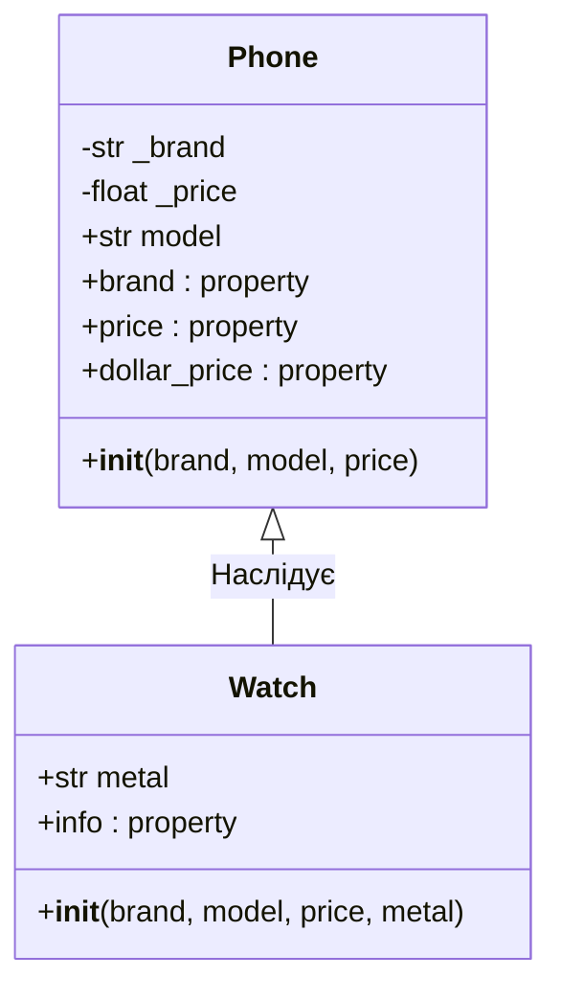

### Львівський національний університет ветеринарної медицини та біотехнологій імені С.З. Ґжицького

## Кафедра інформаційних технологій
# Звіт про виконання лабораторної роботи №10

## На тему "Мета роботи - засвоїти застосування принципу поліморфізму в об’єктно-орієнтованому програмуванні."

*Виконала студентка групи КН-21 Кава Анастасія* 

*Прийняв доц. Андрій Татомир*

### Львів 2026

---

**Мета роботи** - освоїти роботу з декораторами в Python 3.

## Хід роботи

## Хід роботи

1. **В [лаб10](lab10.py) були створені захищені атрибутами _brand та _price для контролю прямого доступу та за допомогою декоратора @property реалізовано методи для отримання значень бренду та ціни як звичайних атрибутів.**
2. **Створений сеттер для атрибута price, який перевіряє коректність введених даних і заборона від’ємних значень перед записом, і метод для видалення ціни за допомогою декоратора @price.deleter.**
5. **Додано властивість dollar_price для автоматичного перерахунку ціни за курсом у момент звернення.**

## Висновки

На лабораторній роботі я опанувала інкапсуляцію за допомогою декоратора @property. Навчилася створювати геттери, сеттери та делетери, що дозволило контролювати доступ до даних, реалізувати валідацію, тобто захист від від’ємної ціни. Це забезпечило надійність об'єктів та спростило взаємодію з ними.
