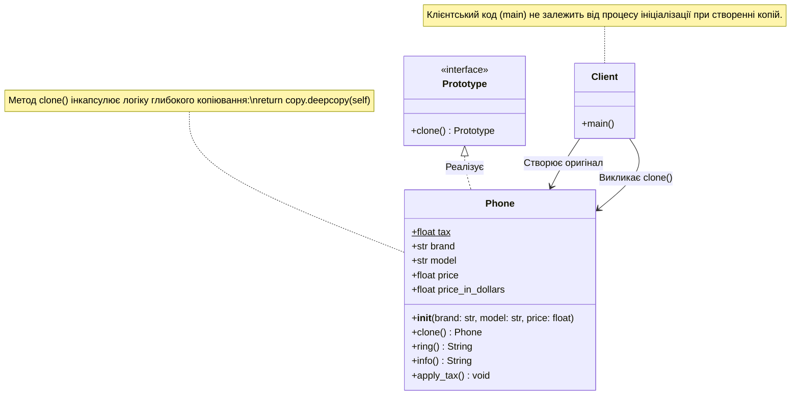

### Львівський національний університет ветеринарної медицини та біотехнологій імені С.З. Ґжицького

## Кафедра інформаційних технологій
# Звіт про виконання лабораторної роботи 

На тему : 

"Твірні шаблони проєктування"

*Виконала студентка групи КН-31 Кава Анастасія* 

*Прийняв доц. Андрій Татомир*

### Львів 2026

---

 **Мета роботи** - ознайомитися з породжувальним патерном проєктування "Прототип" (Prototype), закріпити на практиці його реалізацію в Python та розширити функціонал існуючого класу новими методами.

## Хід роботи

1.  *Для реалізації патерну Прототип було використано import copy та створено метод clone(), який повертає точну незалежну копію поточного об'єкта за допомогою copy.deepcopy(self).*
2. *Було створено оригінальний об'єкт iphone_15. Замість того, щоб створювати наступний об'єкт з нуля, його було клоновано через метод clone() у нову змінну iphone_15_pro. Далі для клону були перезаписані окремі атрибути: модель (на "iPhone 15 Pro"), ціна (на 55000) та відповідно оновлено ціну в доларах.*
3. *За допомогою методу info() було виведено на екран інформацію про базовий об'єкт та його змінений клон. Результат підтвердив, що зміна клону ніяк не вплинула на оригінальний об'єкт (шаблон).*
4. *Також було створено UML-діаграму класу з урахуванням нових атрибутів та методів.*

## Висновки

В результаті виконання роботи я дізналася як реалізовати патерн проєктування "Прототип". Було зрозуміло, що використання модуля copy та методу deepcopy() дозволяє швидко створювати точні та повністю незалежні копії складних об'єктів, які потім можна модифікувати без ризику змінити оригінальний шаблон.