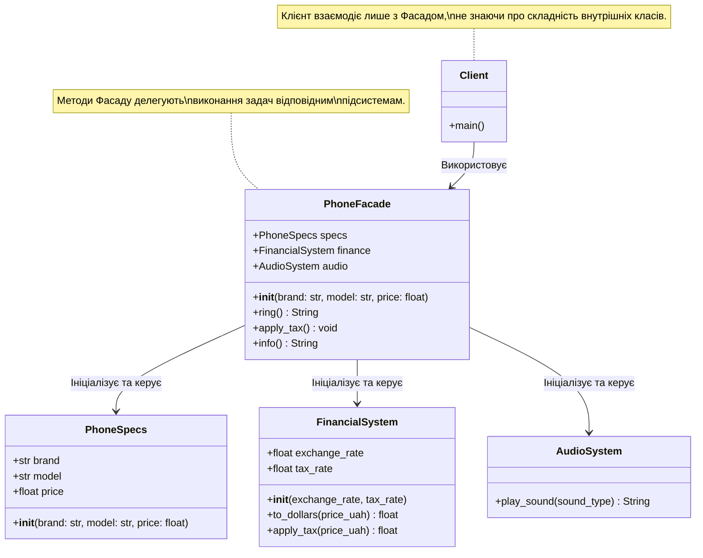

### Львівський національний університет ветеринарної медицини та біотехнологій імені С.З. Ґжицького

## Кафедра інформаційних технологій
# Звіт про виконання лабораторної роботи 

На тему : 

"Структурні шаблони проєктування"

*Виконала студентка групи КН-31 Кава Анастасія* 

*Прийняв доц. Андрій Татомир*

### Львів 2026

---

**Мета роботи** - ознайомитися зі структурним патерном проєктування "Фасад" (Facade), закріпити на практиці його реалізацію в Python та навчитися приховувати складність системи з багатьох класів за єдиним зручним інтерфейсом.

## Хід роботи

1. *Було створено систему, що складається з кількох окремих підсистем (класів): `PhoneSpecs` , `FinancialSystem` та `AudioSystem`.*
2. *Для реалізації патерну Фасад було створено клас `PhoneFacade`. В його конструкторі ініціалізуються об'єкти всіх вищезгаданих підсистем, що дозволяє інкапсулювати їхню логіку всередині фасаду.*
3. *У класі `PhoneFacade` були реалізовані прості методи `ring()`, `apply_tax()` та `info()`. Ці методи діють як делегати: вони не виконують логіку самостійно, а викликають відповідні методи у потрібних підсистем (наприклад, `self.finance.apply_tax()` або `self.audio.play_sound()`).*
4. *У клієнтському коді було створено єдиний об'єкт `iphone_15` через клас-фасад. Виклик методів підтвердив, що клієнт може легко керувати складною логікою (виводити інформацію з конвертацією валют, застосовувати податок, викликати звук дзвінка), не знаючи про існування та специфіку роботи внутрішніх класів `PhoneSpecs`, `FinancialSystem` та `AudioSystem`.*
5. *Також було створено UML-діаграму класів, яка наочно демонструє структуру патерну та взаємодію фасаду з підсистемами.*

## Висновки

В результаті виконання роботи я дізналася як реалізувати патерн проєктування "Фасад". Було зрозуміло, що використання цього патерну дозволяє значно спростити клієнтський код шляхом надання єдиного, зручного інтерфейсу (`PhoneFacade`) для роботи з набором складних підсистем (`PhoneSpecs`, `FinancialSystem`, `AudioSystem`). Це зменшує зв'язність коду (loose coupling) і дозволяє легко змінювати внутрішню логіку підсистем без необхідності переписувати клієнтську частину програми.