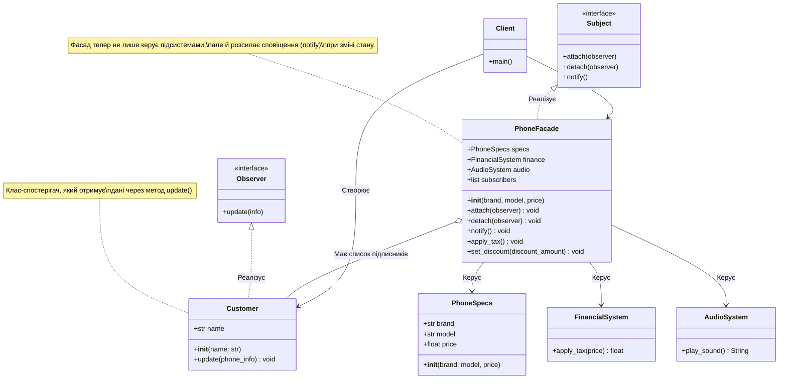

### Львівський національний університет ветеринарної медицини та біотехнологій імені С.З. Ґжицького

## Кафедра інформаційних технологій
# Звіт про виконання лабораторної роботи 

На тему : 

"Поведінкові шаблони проєктування"

*Виконала студентка групи КН-31 Кава Анастасія* 

*Прийняв доц. Андрій Татомир*

### Львів 2026

---

**Мета роботи** - ознайомитися з комбінуванням патернів проєктування, зокрема структурного патерну "Фасад" (Facade) та поведінкового патерну "Спостерігач" (Observer), закріпити на практиці їх спільну реалізацію в Python для спрощення інтерфейсу системи та створення гнучкого механізму підписок на події.

## Хід роботи

1. *Було створено систему, що складається з кількох підсистем `PhoneSpecs`, `FinancialSystem`, `AudioSystem` та потребує механізму інформування клієнтів про зміну стану (ціни).*
2. *Для приховування складності внутрішніх класів було використано патерн "Фасад" - створено клас `PhoneFacade`, який керує підсистемами, що було реалізовано в минулій лабораторній.*
3. *Для реалізації патерну "Спостерігач" було створено клас підписника `Customer` із методом `update()`, який приймає та виводить повідомлення. Сам клас `PhoneFacade` було розширено логікою видавця (Subject): додано список підписників `subscribers` та методи керування ними — `attach()` (підписати), `detach()` (відписати) та `notify()` (сповістити всіх).*
4. *Методи фасаду, які змінюють стан об'єкта, а саме `apply_tax()` та `set_discount()`, були налаштовані таким чином, щоб після кожної зміни ціни автоматично викликався метод `notify()` для розсилки актуальної інформації.*
5. *У клієнтському коді протестовано роботу обох патернів: створено фасад, підписано двох клієнтів. Після застосування податку обидва отримали сповіщення. Потім одного з клієнтів було відписано `detach`, і після застосування знижки сповіщення отримав лише той клієнт, що залишився у списку підписників.*
6. *Також було створено UML-діаграму класів, яка наочно демонструє взаємодію Фасаду з внутрішніми підсистемами та реалізацію механізму підписки Спостерігачів.*

## Висновки

В результаті виконання роботи я дізналася як на практиці поєднувати кілька патернів проєктування. Використання патерну **"Фасад"** дозволило сховати складну логіку (характеристики, фінанси, звук) за єдиним інтерфейсом, а інтеграція патерну **"Спостерігач"** додала системі гнучкості. Тепер об'єкт здатен автоматично сповіщати зацікавлених користувачів про зміни свого стану (наприклад, зміну ціни) без жорсткої прив'язки до конкретних класів клієнтів. Це значно підвищує масштабованість коду, адже можна додавати нових підписників не змінюючи при цьому логіку самого Фасаду.