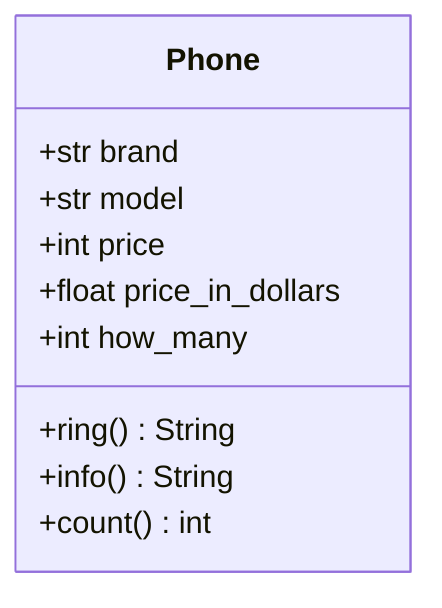

### Львівський національний університет ветеринарної медицини та біотехнологій імені С.З. Ґжицького

## Кафедра інформаційних технологій
# Звіт про виконання лабораторної роботи №6

## На тему "Змінні класу та об’єкта"

*Виконала студентка групи КН-21 Кава Анастасія* 

*Прийняв доц. Андрій Татомир*

### Львів 2026

---

**Мета роботи** - Ознайомитися з різними типами змінних в об’єктно-орієнтованому програмуванні

1. *За основу виконання (lab6)[lab6.py] взято клас Phone. Створено змінну класу dollar, яка відображає  курс валют(долар) для перетворення ціни, та реалізовано метод new_dollar, який дозволяє оновлювати розрахунок вартості пристрою в доларах при зміні курсу.*

2. *Також реалізовано лічильник об'єктів, який здійснює автоматичний підрахунок створених екземплярів (телефонів) за допомогою Phone.how_many += 1 у конструкторі.*

## Висновки
Навчилась використовувати змінні класу для створення лічильника, а також працювати з декоратором @classmethod та підраховувати кількість обʼєктів.