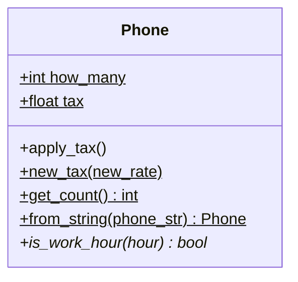

## Львівський національний університет ветеринарної медицини та біотехнологій імені С.З. Ґжицького

### Кафедра інформаційних технологій 

# Звіт про виконання лабораторної роботи №7
*На тему: "Використання методів класу і статичних методів"*

*Виконала студентка групи КН-21 Кава Анастасія* 

*Прийняв доц. Андрій Татомир*

### Львів 2026

---

**Мета роботи** - полягає в ознайомленні з різними типами методів у
об’єктно-орієнтованому програмуванні.

## Хід роботи 
1. *За основу виконання (lab7)[lab7.py] взято клас Phone. Для виконання завдання створено метод класу tax, за допомогою якого можна змінювати атрибут класу tax (податок), що впливає на всі об'єкти одночасно.*

2. *У ході роботи додано альтернативний конструктор через метод класу from_string. Він приймає дані про телефон у вигляді рядка (наприклад, "Бренд-Модель-Ціна"), розділяє їх за допомогою методу split("-") та повертає новий екземпляр класу.*

3. *Реалізовано статичний метод is_work_hour, який працює незалежно від конкретного об'єкта. За допомогою нього можна визначити, чи є вказана година робочим часом магазину (в діапазоні від 9:00 до 18:00).*

## Висновок
Я навчилась застосовувати методи класу та статичний метод. Зрозуміла різницю між типами методів та практичне застосування альтернативних конструкторів для ініціалізації об'єктів.