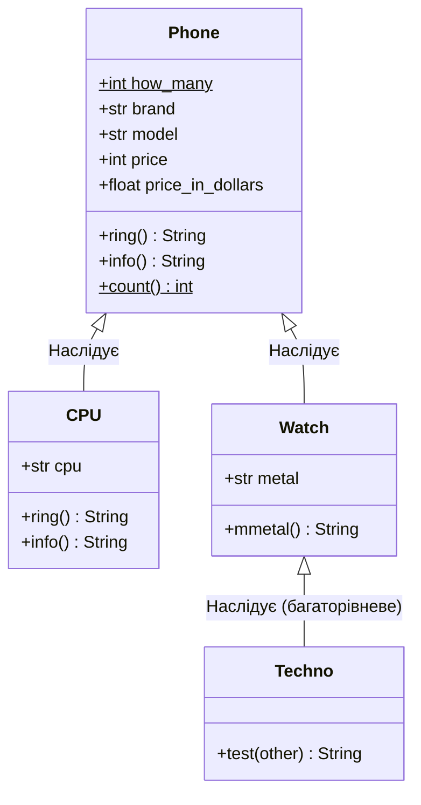

### Львівський національний університет ветеринарної медицини та біотехнологій імені С.З. Ґжицького

## Кафедра інформаційних технологій
# Звіт про виконання лабораторної роботи №8

## На тему "Оволодіти концепцією наслідування класів."

*Виконала студентка групи КН-21 Кава Анастасія* 

*Прийняв доц. Андрій Татомир*

### Львів 2026

---

**Мета роботи** - Оволодіти концепцією наслідування класів.

## Хід роботи

1. *Створено батьківський клас Phone в [програмі](lab8.py), який інкапсулює спільні атрибути (бренд, модель, ціна) та методи (ring, info). Використано змінні класу для підрахунку створених об'єктів.*
2. *Реалізовано дочірні класи CPU та Watch. Використано функцію super() для розширення функціоналу конструктора та методів батьківського класу. Це дозволяє уникнути дублювання коду та забезпечує поліморфізм (різну поведінку методу ring() для різних пристроїв).*
3. *Techno, який є нащадком Watch. Це демонструє ланцюгову передачу властивостей від Phone через Watch до Techno.*
4. *Також була створена діаграма, яка є наведена нище*

## Висновки

: На лабораторній роботі я опанувалп наслідування в Python. Навчилась створювати ієрархію класів, використовувати функцію super() для розширення методів батьківського класу та перевизначати їхню поведінку (поліморфізм). На практиці зрозуміла, як багаторівневе наслідування допомагає уникати дублювання коду та структурувати програму.
