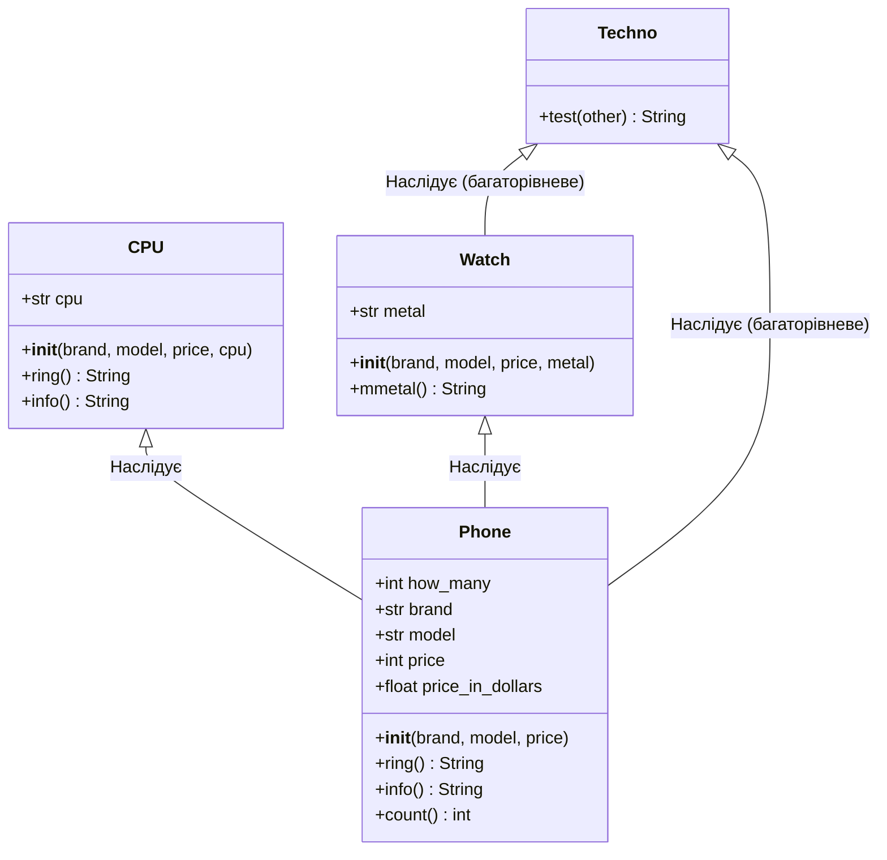

### Львівський національний університет ветеринарної медицини та біотехнологій імені С.З. Ґжицького

## Кафедра інформаційних технологій
# Звіт про виконання лабораторної роботи 

## На тему "Наслідування в об’єктно-орієнтованому програмуванні"

*Виконала студентка групи КН-21 Кава Анастасія* 

*Прийняв доц. Андрій Татомир*

### Львів 2026

---

**Мета роботи** - оволодіти концепцією наслідування класів.

## Хід роботи

1. Було створено батьківський клас (Phone), який має базовий набір атрибутів, методів, які потім унаслідують дочірні класи(нащадки)
2. Були створені дочірні класи CPU, Watch, а згодом Techno, через функцію super унаслідують задані атрибути в батьківському класі. Також завдяки цьому функцію можна унаслідувати їх і змінювати 
3. 

