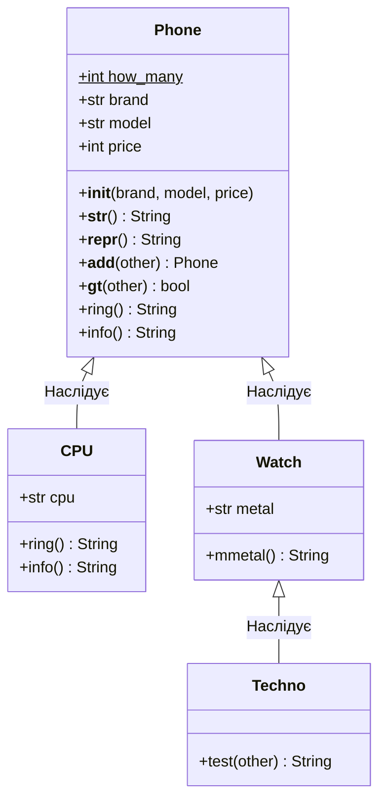

### Львівський національний університет ветеринарної медицини та біотехнологій імені С.З. Ґжицького

## Кафедра інформаційних технологій
# Звіт про виконання лабораторної роботи №9

## На тему "Мета роботи - засвоїти застосування принципу поліморфізму в об’єктно-орієнтованому програмуванні."

*Виконала студентка групи КН-21 Кава Анастасія* 

*Прийняв доц. Андрій Татомир*

### Львів 2026

---

**Мета роботи** - засвоїти застосування принципу поліморфізму в
об’єктно-орієнтованому програмуванні.

## Хід роботи

## Висновки 

На лабораторній роботі я засвоїла принцип поліморфізму через перевантаження стандартних методів Python. Реалізувала магічні методи для порівняння об'єктів за ціною та їхнього додавання. Також застосував декоратори @property для контролю доступу до даних та автоматичного обчислення вартості у валюті за формулою: