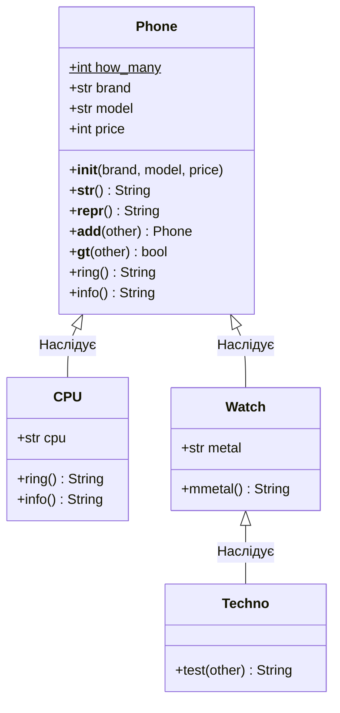

### Львівський національний університет ветеринарної медицини та біотехнологій імені С.З. Ґжицького

## Кафедра інформаційних технологій
# Звіт про виконання лабораторної роботи №9
на тему: 
## "Застосування принципу поліморфізму в об’єктно-орієнтованому програмуванні"

*Виконала студентка групи КН-21 Кава Анастасія* 

*Прийняв доц. Андрій Татомир*

### Львів 2026

---

**Мета роботи** - засвоїти застосування принципу поліморфізму в об’єктно-орієнтованому програмуванні.

1. Застосовано декоратори `@property` для атрибута ціни. Створено геттер для читання, сеттер для захисту від запису від'ємних значень та обчислювану властивість для автоматичного конвертування ціни у долари
2. Реалізовано метод `__gt__` (greater than), що дозволило використовувати стандартний математичний оператор > для порівняння двох об'єктів Phone за їхньою ціною, а також інші методи як Реалізовано метод `__add__,` який дозволяє додавати два об'єкти (оператор +) і повертати новий екземпляр
3. У класі Techno створено метод test(other), який приймає як аргумент екземпляри інших класів. Це дозволило продемонструвати здатність викликати методи переданого об'єкта незалежно від його точного класу.

## Хід роботи

```mermaid
classDiagram
    class Phone {
        +int how_many$
        +str brand
        +str model
        +int price
        +__init__(brand, model, price)
        +__str__() String
        +__repr__() String
        +__add__(other) Phone
        +__gt__(other) bool
        +ring() String
        +info() String
    }
    class CPU {
        +str cpu
        +ring() String
        +info() String
    }
    class Watch {
        +str metal
        +mmetal() String
    }
    class Techno {
        +test(other) String
    }

    Phone <|-- CPU : Наслідує
    Phone <|-- Watch : Наслідує
    Watch <|-- Techno : Наслідує
```

## Висновки 

На лабораторній роботі я засвоїла принцип поліморфізму через перевантаження стандартних методів Python. Реалізувала магічні методи для порівняння об'єктів за ціною та їхнього додавання. Також застосував декоратори @property для контролю доступу до даних та автоматичного обчислення вартості у валюті за формулою:
