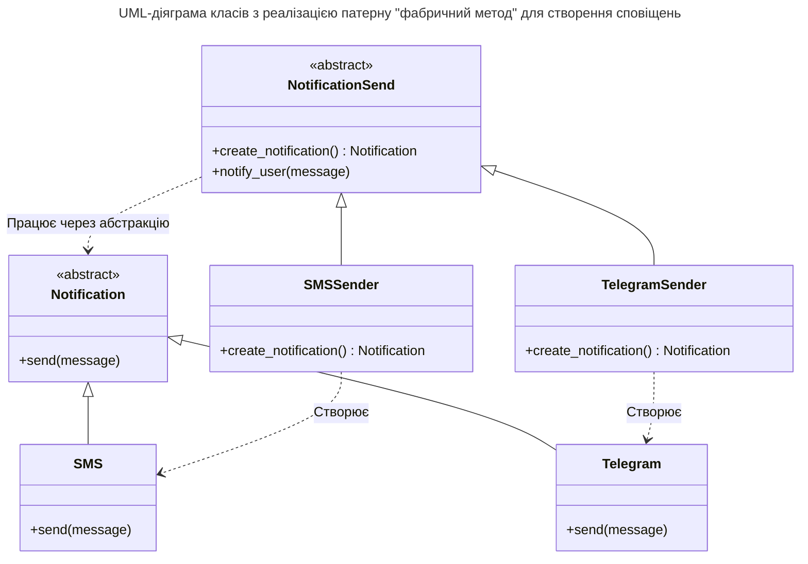

## Львівський національний університет ветеринарної медицини та біотехнологій імені С.З. Ґжицького

### Кафедра інформаційних технологій 

# Звіт 
про виконання лабораторної роботи №12
на тему: 

**"Твірні шаблони проєктування"**

Виконав студент групи КН-31 Кудла Данило

Прийняв доц. Андрій Татомир

### Львів 2026

---

**Мета роботи** - познайомитися з групою твірних шаблонів проєктування.

## Хід роботи

1. Твірні шаблони - це група патернів, що абстрагує процес інстанціювання об'єктів. Вони забезпечують гнучке та безпечне створення сутностей без жорсткої прив'язки коду до конкретних класів та прямого використання оператора **new**.
2. Фабричний метод - це твірний патерн проєктування, який визначеє загальний інтерфейс для створення об'єктів у батьківському класі, але дозволяє дочірнім класам змінювати тип створюваних об'єктів. 
 Приклад реалізованого фабричного шаблону на основі сповіщень [lab12](lab12.py).

## Висновок
У підсумку виконання лабораторної роботи ознайомився з п'ятьма твірними шаблонами, а саме: фабричний метод, абстрактна фабрика, прототип, будівельник, одинак. На практиці реалізовано фабричний метод на основі сповіщень, що дало змогу освоїти механізм делегування створення об'єктів підкласам. Завдяки цьому вдалося відокремити логіку від процесу інстанціювання конкретних класів, також уникнути прив'язки до них та зробити систему гнучкою для додавання нових типів сповіщень у майбутньому без зміни існуючого коду.