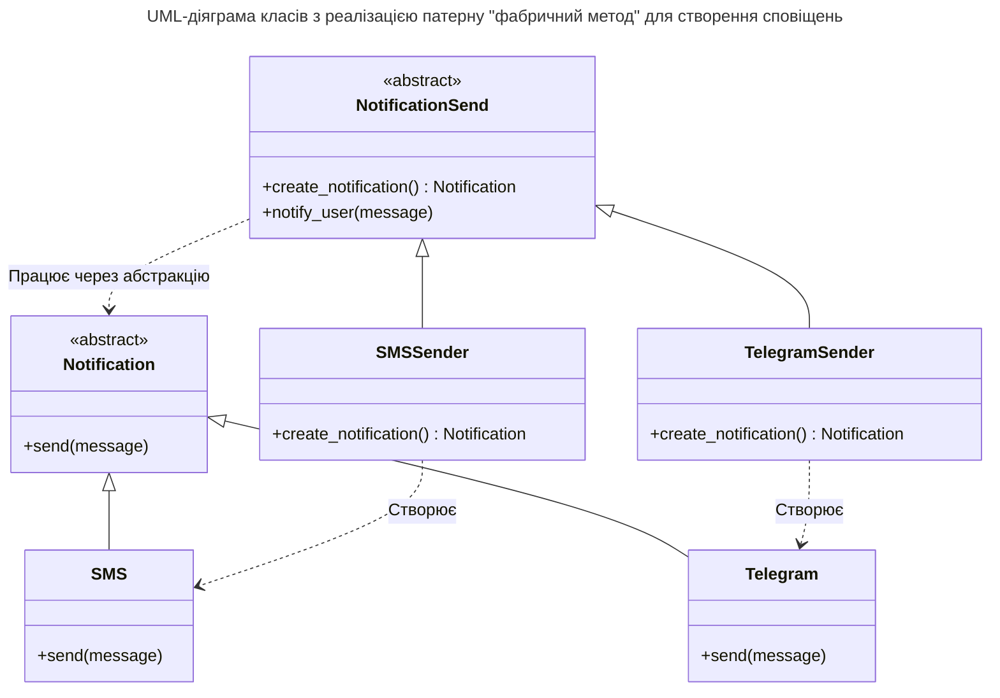

## Львівський національний університет ветеринарної медицини та біотехнологій імені С.З. Ґжицького

### Кафедра інформаційних технологій 

# Звіт 
про виконання лабораторної роботи №12
на тему: 

**"Твірні шаблони проєктування"**

Виконав студент групи КН-31 Кудла Данило

Прийняв доц. Андрій Татомир

### Львів 2026

---

**Мета роботи** - познайомитися з групою твірних шаблонів проєктування.

## Хід роботи

1. Опрацьовано твірні шаблони, які відокремлюють процес використання об'єктів від процесу їх створення. Їхня головна мета полягає зробити так, щоб система знала лише про інтерфейси об'єктів з якими працює і нічого не знала про їхні конкретні класи та способи інстанціювання.
2. Фабричний метод являє собою твірний патерн проєктування, який надає загальний інтерфейс для створення об'єктів у базовому класі та дозволяє підкласам визначати їхній конкретний тип. 
 У моїй роботі цей патерн вирішує проблему створення різних типів об'єктів без жорсткої прив'язки клієнтського коду до їхніх конкретних класів. 
 Якщо б не використання фабричний метод дану проблему можна було б вирішити шляхом створення екземплярів через умовні оператори та прямий виклик конструкторів у місцях їх використання. Використання фабричного методу обумовлене, щоб інкапсулювати логіку створення об'єктів в одному місці і забезпечити можливість розширення програми без зміни існуючого коду.
 Приклад реалізованого фабричного шаблону на основі сповіщень [lab12](lab12.py).

```mermaid
---
title: UML-діяграма класів з реалізацією патерну "фабричний метод" для створення сповіщень
---
classDiagram
    direction TB

    class Notification {
        <<abstract>>
        +send(message)
    }
    class SMS {
        +send(message)
    }
    class Telegram {
        +send(message)
    }
    
    class NotificationSend {
        <<abstract>>
        +create_notification() Notification
        +notify_user(message)
    }
    class SMSSender {
        +create_notification() Notification
    }
    class TelegramSender {
        +create_notification() Notification
    }

    NotificationSend ..> Notification : Працює через абстракцію
    
    NotificationSend <|-- SMSSender
    NotificationSend <|-- TelegramSender
    Notification <|-- SMS
    Notification <|-- Telegram

    SMSSender ..> SMS : Створює
    TelegramSender ..> Telegram : Створює
```
## Висновок
У підсумку виконання лабораторної роботи ознайомився з п'ятьма твірними шаблонами, а саме: фабричний метод, абстрактна фабрика, прототип, будівельник, одинак. На практиці навчився працювати з фабричним методом, що дало змогу опанувати механізм створення об'єктів підкласам.