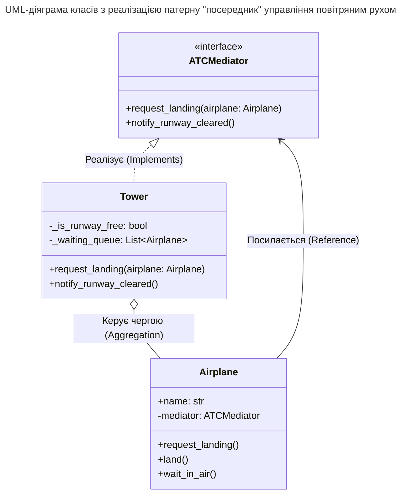

## Львівський національний університет ветеринарної медицини та біотехнологій імені С.З. Ґжицького

### Кафедра інформаційних технологій 

# Звіт 
про виконання лабораторної роботи №14
на тему: 

**"Поведінкові шаблони проєктування"**

Виконав студент групи КН-31 Кудла Данило

Прийняв доц. Андрій Татомир

### Львів 2026

---

**Мета роботи** - познайомитися з групою поведінкових шаблонів
проєктування.

## Хід роботи

1. У ході лабораторної роботи опрацьовано поведінковий патерн проєктування, який вирішує завдання з ефективної комунікації та правильного розподілу обов'язків між об'єктами в програмі.
2. Для реалізації роботи взято шаблон посередник, він дає змогу зменшити зв'язаність великої кількості класів між собою, через переміщення зв'язків до одного класу.
  приклад реалізованого посередника за основою системи управління повітряним рухом [lab14](lab14.py).

## Висновок
У підсумку лабораторної роботи ознайомився з десятьма патернами, а саме: ланцюжок обов'язків, команда, ітератор, посередник, знімок, спостерігач, стан, стратегія, шаблонний метод, відвідувач. У завданні реалізовано патерн "посередник", який виконує роль системи управління повітряним рухом, що мінімізувало хаотичні зв'язки та зробило класи абсолютно незалежними один від одного.