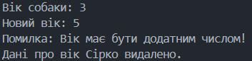

**Львівський національний університет ветеринарної медицини та біотехнологій імені С.З. Ґжицького**

**Кафедра інформаційних технологій**

# Звіт про виконання лабораторної роботи №10
На тему 
"Використання декораторів методів "

Виконала студентка групи Кн-21 Вечера Надія

Прийняв доц. Андрій Татомир

### Львів 2026

---

**Мета роботи** -  засвоїти застосування принципу поліморфізму в 
об’єктно-орієнтованому програмуванні.. 

## Хід роботи 

**Завдання**:

1. Навчитися використовувати декоратор “@property”. Написати принаймні 
один метод з його використанням. 
2. Ознайомитися з концепцією getter’ів, setter’ів і delete’рів. Реалізувати хоча 
б один метод з їх використанням.

Код [програми](lab10.py) де я виконала завдання.

**Пояснення**:

1. Декоратор **@property**

Декоратор @property дозволяє звертатися до методу класу так, ніби це звичайний атрибут (без дужок ()). Це робить інтерфейс класу чистішим і дозволяє реалізувати інкапсуляцію (створення «захисної оболонки» навколо даних об'єкта,обмежує прямий доступ до них ззовні) — ми приховуємо реальне поле _age за логікою методу.

2. Концепція Getter, Setter та Deleter 

Ці методи дозволяють контролювати доступ до даних об'єкта:

**Getter (отримувач)**: Повертає значення. Тут можна змінити формат даних перед видачею.

**Setter (встановлювач)**: Дозволяє перевіряти дані перед записом (наприклад, щоб вік не був від'ємним). Це захищає об'єкт від некоректних станів.

**Deleter (видаляч)**: Визначає, що має статися при видаленні атрибута (наприклад, очищення пам'яті або запис у лог).

3. Наслідування властивостей

Оскільки Dog наслідує Animal, він автоматично отримує доступ до властивості age. Це ще один приклад повторного використання коду, де нам не потрібно знову прописувати логіку перевірки віку для кожного виду тварин.

Результат: 

**Висновки**:

Під час виконання цієї роботи я навчилася:

Використовувати декоратор @property для створення керованих атрибутів класу.

Реалізовувати методи доступу (Getter/Setter/Deleter), що дозволило забезпечити цілісність даних всередині об'єктів.

Поєднувати наслідування з властивостями, передаючи логіку обробки даних від батьківських класів до дочірніх.

Керувати інкапсуляцією, використовуючи захищені атрибути (з одним підкресленням _).

