**Львівський національний університет ветеринарної медицини та біотехнологій імені С.З. Ґжицького**

**Кафедра інформаційних технологій**

# Звіт про виконання лабораторної роботи №12
На тему 
"Твірні шаблони проєктування"

Виконала студентка групи Кн-21 Вечера Надія

Прийняв доц. Андрій Татомир

### Львів 2026

---

**Мета роботи** - познайомитися з групою твірних шаблонів проєктування.

## Хід роботи

**1**) Теоретичний опис твірної групи шаблонів

Твірні шаблони (Creational Patterns) — це шаблони проєктування, які абстрагують процес створення об'єктів. Вони дозволяють зробити систему незалежною від того, як її об'єкти створюються, компонуються та ініціалізуються.

Існуючі твірні шаблони:

Factory Method (Фабричний метод),Abstract Factory (Абстрактна фабрика),Singleton (Одинак),Builder (Будівельник),Prototype (Прототип).

Основні переваги використання твірних шаблонів:

1) Гнучкість: Дозволяють змінювати типи створюваних об'єктів без зміни коду, який їх використовує.

2) Повторне використання: Зменшують дублювання коду під час ініціалізації складних об'єктів.

3) Сховування складності: Приховують деталі реалізації створення об'єктів за зручними інтерфейсами.

**2**) Реалізація індивідуального завдання

(Як приклад я взяла один із найпопулярніших твірних шаблонів — Фабричний метод / Factory Method).

**Теоретичний опис шаблону «Фабричний метод» (Factory Method)**

Фабричний метод — це твірний шаблон проєктування, який визначає загальний інтерфейс для створення об'єктів у суперкласі, але дозволяє підкласам змінювати тип створюваних об'єктів.

Коли використовувати: Коли заздалегідь невідомо, об'єкти яких типів жорстко потрібні в програмі, або коли система має бути розширюваною для нових продуктів.

**Завдання**:
Реалізований код відповідає роботі з різними форматами файлів та документів.

Код [програми](lab12.py) де реалізований код.

Ось створена його UML-діаграма через сайт mermaid.

**Висновки**:

У ході виконання лабораторної роботи я ознайомилвся з групою твірних шаблонів проєктування, які призначені для абстрагування процесу створення об'єктів та зменшення залежності системи від конкретних класів.

На практиці було реалізовано шаблон проєктування «Фабричний метод» мовою Python. Під час виконання індивідуального завдання було побудовано архітектуру для роботи з різними типами документів (PDFDocument та WordDocument), створено відповідні класи-фабрики (PDFCreator, WordCreator) та побудовано UML-діаграму класів.
