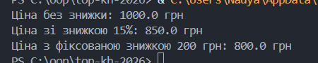

**Львівський національний університет ветеринарної медицини та біотехнологій імені С.З. Ґжицького**

**Кафедра інформаційних технологій**

# Звіт про виконання лабораторної роботи №13
На тему 
"Структурні шаблони проєктування"

Виконала студентка групи Кн-31 Вечера Надія

Прийняв доц. Андрій Татомир

### Львів 2026

---

**Мета роботи** - познайомитися з групою структурних шаблонів
проєктування.

## Хід роботи

Поведінкові шаблони відповідають за ефективну взаємодію, розподіл обов'язків та обмін повідомленнями між об'єктами. Вони допомагають зробити зв'язки між об'єктами гнучкими та слабко пов'язаними.

***Основні поведінкові шаблони:*** 

Стратегія (Strategy) — визначає сімейство алгоритмів, інкапсулює кожен із них і робить їх взаємозамінними. Дозволяє змінювати алгоритми незалежно від клієнтів, які їх використовують.

Спостерігач (Observer) — створює механізм підписки, який сповіщає декілька об'єктів про будь-які події, що відбуваються з об'єктом, за яким вони спостерігають.

Команда (Command) — перетворює запити на об'єкти, що дозволяє передавати їх як аргументи при виклику методів, ставити у чергу, логувати та підтримувати скасування операцій (Undo/Redo).

Стан (State) — дозволяє об'єкту змінювати свою поведінку залежно від внутрішнього стану, створюючи враження, що змінився клас об'єкта.

Шаблонний метод (Template Method) — визначає скелет алгоритму в суперкласі, дозволяючи підкласам перевизначати конкретні кроки алгоритму без зміни його загальної структури.

Ітератор (Iterator) — дає можливість послідовно обходити елементи складеного об'єкта (колекції), не розкриваючи його внутрішнього представлення.

Ланцюжок відповідальності (Chain of Responsibility) — дозволяє передавати запити послідовно по ланцюжку обробників, де кожен обробник вирішує, чи обробити запит, чи передати його далі.

Посередник (Mediator) — зменшує пов'язаність багатьох класів між собою, примушуючи їх взаємодіяти тільки через спеціальний об'єкт-посередник.

Знімок (Memento) — дозволяє зберігати та відновлювати минулий стан об'єкта, не порушуючи його інкапсуляцію.

Відвідувач (Visitor) — дозволяє додавати нові операції до структури об'єктів без зміни класів цих об'єктів.

**Завдання**:

Ось практичний приклад на Python, де програма розраховує підсумкову вартість замовлення з урахуванням різних типів знижок.

Код [програми](lab13.py) де реалізований код.

Результат виконання програми

**Висновок**:
У ході виконання лабораторної роботи я дізналась про поведінкові шаблони та яка кількість їх існує та практично опрацювала один із цих шаблонів проєктування.
