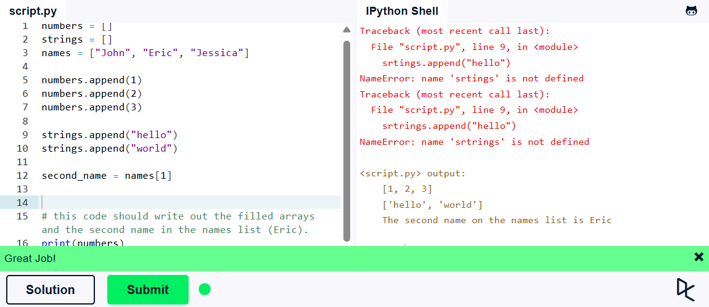

**Львівський національний університет ветеринарної медицини та біотехнологій імені С.З. Ґжицького**

# Звіт про виконання лабораторної роботи №2
На тему 
"Вивчення вбудованих типів даних і методів роботи з ними у Python 3"

Виконала студентка групи Кн-21 Вечера Надія

Прийняв доц. Андрій Татомир

### Львів 2026

---

**Мета роботи** - Метою роботи є вивчення основ розробки додатків на Python 3.

## Хід роботи

1. **Змінні та типи:**
```python
mystring = "hello"
myfloat = 10.0
myint = 20

if mystring == "hello":
    print("String: %s" % mystring)
if isinstance(myfloat, float) and myfloat == 10.0:
    print("Float: %f" % myfloat)
if isinstance(myint, int) and myint == 20:
    print("Integer: %d" % myint)
```

**Результат:**


2. **Списки:**
```python
numbers = []
strings = []
names = ["John", "Eric", "Jessica"]

numbers.append(1)
numbers.append(2)
numbers.append(3)

strings.append("hello")
strings.append("world")

second_name = names[1]

print(numbers)
print(strings)
```

**Результат:**



3. **Основні оператори:**
```python
x = object()
y = object()

x_list = [x] * 10
y_list = [y] * 10
big_list = x_list + y_list

print("x_list contains %d objects" % len(x_list))
print("y_list contains %d objects" % len(y_list))
print("big_list contains %d objects" % len(big_list))

if x_list.count(x) == 10 and y_list.count(y) == 10:
    print("Almost there...")
if big_list.count(x) == 10 and big_list.count(y) == 10:
    print("Great!")
```

**Результат:**


4. **Словники:**
```python
phonebook = {  
    "John" : 938477566,
    "Jack" : 938377264,
    "Jill" : 947662781,
    "Jake" : 938273443.    
}  
phonebook.pop("Jill")

if "Jake" in phonebook:  
    print("Jake is listed in the phonebook.")
    
if "Jill" not in phonebook:      
    print("Jill is not listed in the phonebook.")
```

**Результат:**


5. **Основні операції з рядками:**
```python
s = "Strings are awesome!"
print("Length of s = %d" % len(s))

print("The first occurrence of the letter a = %d" % s.index("a"))

print("a occurs %d times" % s.count("a"))


print("The first five characters are '%s'" % s[:5]) # Start to 5
print("The next five characters are '%s'" % s[5:10]) # 5 to 10
print("The thirteenth character is '%s'" % s[12]) # Just number 12
print("The characters with odd index are '%s'" %s[1::2]) #(0-based indexing)
print("The last five characters are '%s'" % s[-5:]) # 5th-from-last to end


print("String in uppercase: %s" % s.upper())

print("String in lowercase: %s" % s.lower())


if s.startswith("Str"):
    print("String starts with 'Str'. Good!")


if s.endswith("ome!"):
    print("String ends with 'ome!'. Good!")


print("Split the words of the string: %
```
**Результат:**


### Висновок
В цій практичній роботі я попрактикувалась з синтаксисом Python 3 та повторила інші оператори. Сподобався сайт буду далі з ним працювати.
