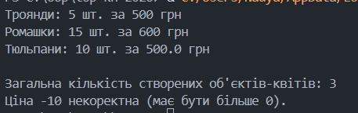

**Львівський національний університет ветеринарної медицини та біотехнологій імені С.З. Ґжицького**

**Кафедра інформаційних технологій**

# Звіт про виконання лабораторної роботи №2
На тему 
"Використання методів класу і статичних методів"

Виконала студентка групи Кн-21 Вечера Надія

Прийняв доц. Андрій Татомир

### Львів 2026

---

**Мета роботи** -  Мета роботи полягає в ознайомленні з різними типами методів у 
об’єктно-орієнтованому програмуванні.

## Хід роботи 

В умові виконання завдання потрібно:
1. Для створеного у попередній роботі класу реалізувати “метод класу”,який повинен працювати зі змінними класу. 
2. Реалізувати альтернативний конструктор класу за допомогою методу класу. 
3.  Створити статичний метод і перевірити його роботу. 

Код [програми](lab6.py) з попередньої роботи який я взяла за основу для виконання завдання.

Що було додано:

1) Альтернативний конструктор **(from_string)**: Це метод класу, який приймає рядок (наприклад, "Тюльпани-10-50"), розбиває його на частини та створює об'єкт. Це зручно, якщо дані приходять із файлу або вводу користувача в одному рядку.

2) Статичний метод **(is_price_valid)**: Використовується декоратор @staticmethod. Цей метод не отримує посилання на клас (cls) або об'єкт (self). Він працює як звичайна функція, але логічно згрупований всередині класу (в даному випадку — для валідації ціни).

3) Змінна класу: Лічильник **total_flowers_count** коректно оновлюється незалежно від того, який конструктор ви викликали (стандартний чи альтернативний).

Реалізований код:
Код[програми](lab7.py)

Результати виконання:

При тестуванні програми було виконано такі дії:

1) Створено два об'єкти стандартним способом: Flower("Троянди", 5, 100) та Flower("Ромашки", 15, 40).

2) Використано альтернативний конструктор для створення об'єкта з рядка "Тюльпани-10-50".

3) Перевірено роботу статичного методу для валідації ціни (наприклад, для значення -10 метод повернув False).

4) Виведено загальну кількість створених квітів (результат: 3).

Висновки:

Під час виконання роботи було засвоєно різницю між методами екземпляра, методами класу та статичними методами.

Звичайні методи — для роботи з конкретною квіткою (об'єктом).

Методи класу (@classmethod) — за допомогою них я створила «розумний» конструктор, який сам розбиває рядок на дані та створює об'єкт.

Статичні методи (@staticmethod) — я використала їх для простої перевірки (валідації) ціни, оскільки це не потребує даних про конкретну квітку.