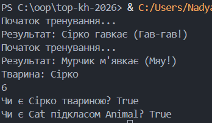

**Львівський національний університет ветеринарної медицини та біотехнологій імені С.З. Ґжицького**

**Кафедра інформаційних технологій**

# Звіт про виконання лабораторної роботи №9
На тему 
"Поліморфізм в Python 3"

Виконала студентка групи Кн-21 Вечера Надія

Прийняв доц. Андрій Татомир

### Львів 2026

---

**Мета роботи** -  засвоїти застосування принципу поліморфізму в 
об’єктно-орієнтованому програмуванні.. 

## Хід роботи 

**Завдання**:

1. Ознайомитися з поняттям поліморфізму в ООП.  
2. Навчитися перевизначати поведінку методів. 
3. Реалізувати декілька “магічних методів” для роботи з визначеними раніше 
класами.

Код [програми](lab9.py) де я виконала завдання.

**Пояснення**

1. Наслідування та повторне використання коду

Завдяки наслідуванню класів Dog та Cat від базового класу Animal, ми уникнули дублювання коду. Атрибут name було визначено один раз у батьківському класі, а дочірні класи отримали його автоматично.

2. Використання методу super()

У класі Dog було застосовано функцію super().__init__(name). Це дозволило викликати логіку ініціалізації батьківського класу, одночасно додаючи унікальний атрибут дочірнього класу — breed (порода).

3. Поняття поліморфізму та перевизначення методів

Мета роботи — опанувати поліморфізм — реалізована через метод speak(). Хоча цей метод є у всіх класів, кожна тварина реагує на нього по-своєму. Клас Trainer може працювати з будь-яким об'єктом, що походить від Animal, не знаючи наперед, який саме звук він видасть.

4. Магічні методи

Було реалізовано методи:

__str__: дозволяє коректно виводити інформацію про об'єкт через print().

__len__: дозволяє використовувати функцію len() для об'єктів класу Cat.

5. Перевірка типів (isinstance, issubclass)
isinstance(my_dog, Animal):

 Повертає True, оскільки об'єкт my_dog створений на основі класу, що наслідує Animal.

issubclass(Cat, Animal): Повертає True, підтверджує ієрархічний зв'язок між самими класами.

Результат:

**Висновки**:
Під час виконання цієї роботи я навчилася:

Застосовувати поліморфізм для зміни поведінки методів у дочірніх класах.

Використовувати магічні методи

Проводити інтроспекцію коду за допомогою перевірки типів та успадкування.
