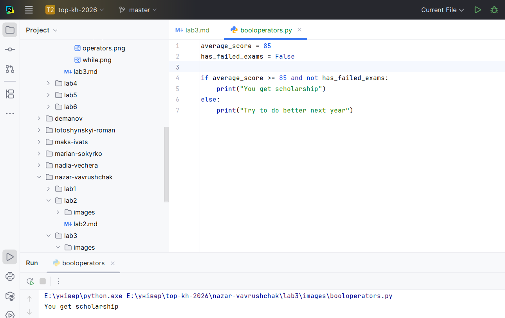
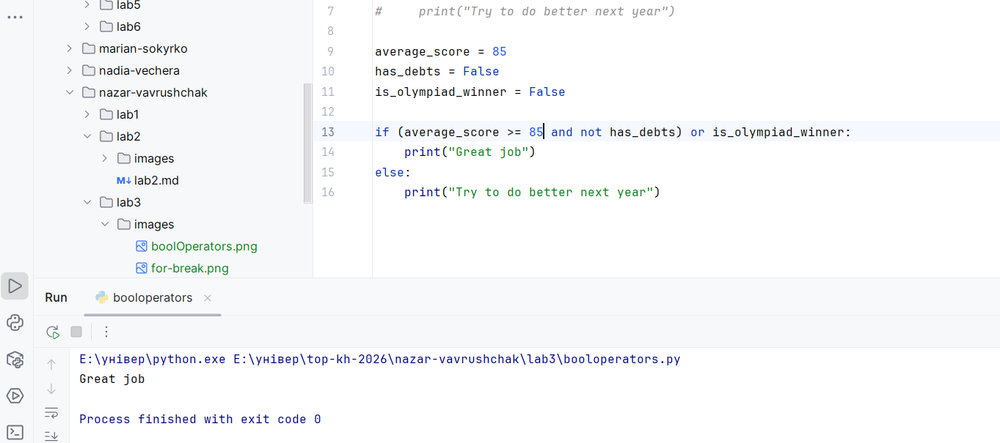
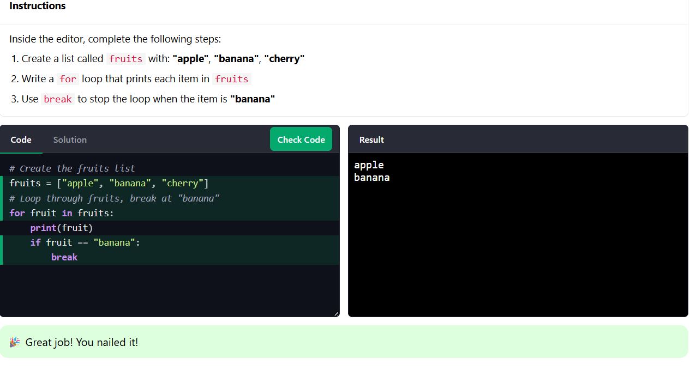

## Львівський національний університет ветеринарної медицини та біотехнологій імені С.З. Ґжицького

# Звіт про виконання лабораторної роботи №3

**На тему:** "Основи структурного програмування в Python 3 "

**Виконав:** студент групи КН-22СП Ваврущак Назар  
**Прийняв:** доц. Андрій Татомир  

### Львів 2026

---

**Мета роботи** – ознайомлення основними прийомами структурного програмування у Python 3.

---

## Хід роботи

### 1-2. Структурне програмування та умовні оператори
Ознайомлено з базовими принципами структурного програмування.
.png)

### 3. Оператори булевої логіки
Вивчено роботу з операторами булевої логіки (`and`, `or`, `not`).

### 4. Проектування складних умов
Набуто навичок проектування складних умов.

### 5-6. Робота з циклами та розв'язання завдань
Опановано методи роботи з циклами. 

.png)

---

## Висновки
Під час виконання лабораторної роботи пригадав як правильно використовувати умовні оператори, та вивчив синтаксис булевих операторів у Python.