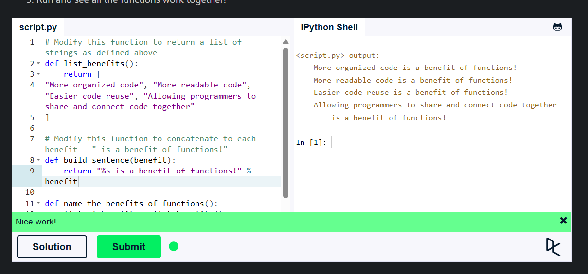
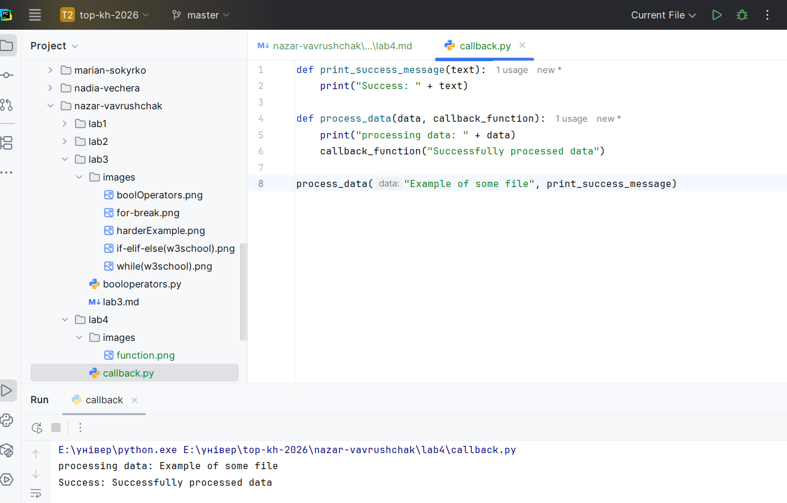

## Львівський національний університет ветеринарної медицини та біотехнологій імені С.З. Ґжицького

# Звіт про виконання лабораторної роботи №4

**На тему:** "Основи процедурного програмування в Python 3"

**Виконав:** студент групи КН-22СП Ваврущак Назар  
**Прийняв:** доц. Андрій Татомир  

### Львів 2026

---

**Мета роботи** –  полягає у засвоєнні студентами методів та прийомів роботи з функціями.

---

## Хід роботи

### 1, 2, 4. Синтаксис функцій, параметри та аргументи, розв'язання заданого прикладу
Освоєно базовий синтаксис створення функцій за допомогою ключового слова `def`. Закріплено поняття параметрів (змінних у визначенні функції) та аргументів (значень, що передаються під час виклику) на практиці. 

### 3. Робота з (Callback)
Вивчено розширені методи роботи з функціями. Реалізовано механізм зворотного виклику (callback), де одна функція (`print_success_message`) передається як аргумент в іншу функцію (`process_data`) як об'єкт (без дужок) і викликається вже всередині її тіла після виконання основних операцій.

## Висновки
Під час виконання даної лабораторної роботи, я засвоїв роботу з функціями у Python, як передавати аргументи та параметри, також як їх викликати, та як виконувати callback