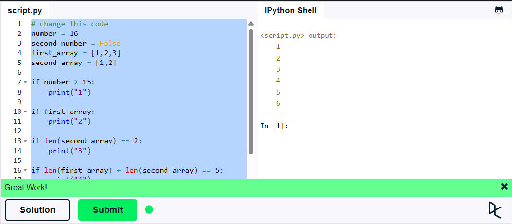
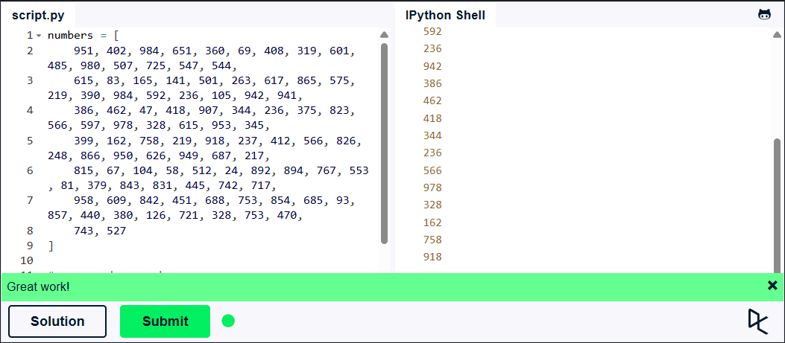

## Львівський національний університет ветеринарної медицини та біотехнологій імені С.З. Ґжицького

# Звіт про виконання лабораторної роботи №3

На тему: "Основи структурного програмування в Python 3 "

Виконав студент групи КН-21 Олександр Верик

Прийняв доц. Андрій Татомир

### Львів 2026

---

**Мета роботи** – ознайомлення основними прийомами структурного
програмування у Python 3.

- Було змінено значення змінних так, щоб усі умови в конструкціях if стали істинними. У результаті було перевірено роботу умовних операторів у Python та поведінку різних типів даних у логічних виразах.

```Python
# change this code
number = 16
second_number = False
first_array = [1,2,3]
second_array = [1,2]

if number > 15:
    print("1")

if first_array:
    print("2")

if len(second_array) == 2:
    print("3")

if len(first_array) + len(second_array) == 5:
    print("4")

if first_array and first_array[0] == 1:
    print("5")

if not second_number:
    print("6")
```



- Було виконано обхід списку за допомогою циклу for, під час якого виводилися лише парні числа. Також було реалізовано перевірку умови зупинки циклу при досягненні значення 237 за допомогою оператора break.

```Python
numbers = [
    951, 402, 984, 651, 360, 69, 408, 319, 601, 485, 980, 507, 725, 547, 544,
    615, 83, 165, 141, 501, 263, 617, 865, 575, 219, 390, 984, 592, 236, 105, 942, 941,
    386, 462, 47, 418, 907, 344, 236, 375, 823, 566, 597, 978, 328, 615, 953, 345,
    399, 162, 758, 219, 918, 237, 412, 566, 826, 248, 866, 950, 626, 949, 687, 217,
    815, 67, 104, 58, 512, 24, 892, 894, 767, 553, 81, 379, 843, 831, 445, 742, 717,
    958, 609, 842, 451, 688, 753, 854, 685, 93, 857, 440, 380, 126, 721, 328, 753, 470,
    743, 527
]

# your code goes here
for number in numbers:
    if number == 237:
        break
    elif number % 2 == 0:
        print(number)

```



- У цьому завданні було опрацьовано роботу циклу while та арифметичне скорочення числа за допомогою цілочисельного ділення //. Це дозволило реалізувати підрахунок кількості цифр у числі без перетворення його у рядок.
  Задачу було взято з сайту - [pynative.com](https://pynative.com/python-if-else-and-for-loop-exercise-with-solutions/#h-exercise-13-count-total-number-of-digits-in-a-number), вправа 13.

```Python
num = 75869
count = 0

while num > 0:
    num = num // 10
    count += 1

print("Total digits are: ", count)  # Буде виведено - Total digits are: 5

```

## Висновки

У ході лабораторної роботи було засвоєно основи структурного програмування та принципи побудови алгоритмів у Python. Було опрацьовано використання умовних операторів, логічних виразів та побудову складних умов. Окрему увагу приділено роботі з циклами та вибору їх доцільного застосування залежно від поставленої задачі. У результаті виконано практичні завдання, що дозволило закріпити отримані теоретичні знання на практиці.
