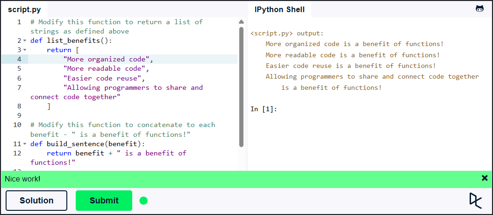

## Львівський національний університет ветеринарної медицини та біотехнологій імені С.З. Ґжицького

# Звіт про виконання лабораторної роботи №4

На тему: "Основи процедурного програмування в Python 3"

Виконав студент групи КН-21 Олександр Верик

Прийняв доц. Андрій Татомир

### Львів 2026

---

**Мета роботи** – Засвоїти методи та прийоми роботи з функціями.

Було створено дві функції:

- list_benefits() — повертає список переваг функцій;
- build_sentence() — формує речення, додаючи до кожної переваги фразу "is a benefit of functions!".

Потім у циклі ці функції використано разом для виведення результату.

```Python
# Modify this function to return a list of strings as defined above
def list_benefits():
    return [
        "More organized code",
        "More readable code",
        "Easier code reuse",
        "Allowing programmers to share and connect code together"
    ]

# Modify this function to concatenate to each benefit - " is a benefit of functions!"
def build_sentence(benefit):
    return benefit + " is a benefit of functions!"

def name_the_benefits_of_functions():
    list_of_benefits = list_benefits()
    for benefit in list_of_benefits:
        print(build_sentence(benefit))

name_the_benefits_of_functions()


```



## Висновок

У ході виконання роботи було повторено синтаксис функцій та закріплено розуміння параметрів і аргументів. Розглянуто принципи виклику функцій і передачі їх як аргументів (callback). У результаті практичного завдання було успішно реалізовано програму, що демонструє спільну роботу кількох функцій.
